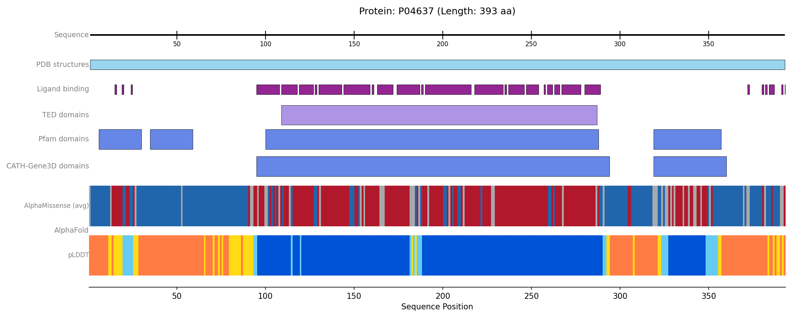

# Protviz: Protein Annotation Visualiser


[](https://github.com/paulynamagana/protviz/actions/workflows/python-tests.yml)

Protviz retrieves protein annotations from public bioinformatics resources and draws them
as aligned tracks along a protein sequence. It can be used from the command line, from a
browser-based interface, or directly from Python.

The `protviz` command covers most needs; the Python API and the scripts in `examples/` are
there for custom or programmatic use.



*Every track Protviz can draw, for human p53 (UniProt P04637), produced by
`protviz P04637 --tracks all`.*

## Motivation

Assembling a single view of what is known about a protein normally means querying several
resources in turn, reconciling their coordinate conventions, and writing bespoke plotting
code. Protviz consolidates that work behind one interface.

The design follows [Gviz](https://bioconductor.org/packages/release/bioc/html/Gviz.html)
from R/Bioconductor: each annotation type is a *track*, tracks share a common coordinate
system, and a figure is simply an ordered list of them. Alongside the built-in tracks for
public databases, `CustomTrack` accepts arbitrary user-supplied annotations, so unpublished
or in-house data can be displayed against the same sequence axis as reference data.

## Installation

Protviz requires Python 3.9 or newer.

```bash
pip install git+https://github.com/paulynamagana/protviz.git
```

For a development install, clone the repository and install in editable mode:

```bash
git clone https://github.com/paulynamagana/protviz.git
cd protviz
pip install -e ".[dev]"
```

## Command-line usage

Installing the package provides a `protviz` command. Supplying a UniProt accession
retrieves the default annotation set and writes a figure:

```bash
protviz P04637
```

This saves `P04637.png` to the current directory.

Protviz identifies proteins by UniProt accession — for example `P04637` or `Q9Y6K9`. Gene
names such as `TP53` are not accepted. The accession for a given protein appears in the
**Entry** column of a search at [uniprot.org](https://www.uniprot.org).

### Common operations

```bash
protviz P04637 -o figure.png         # set the output path
protviz P04637 --region 90-300       # restrict the view to residues 90-300
protviz P04637 --tracks pdb,pfam     # select specific tracks
protviz P04637 --tracks all          # include every available track
protviz P04637 --detail              # one row per entry instead of a merged summary
protviz P04637 --show                # display in a window rather than writing a file
protviz --list-tracks                # describe the available tracks
protviz --help                       # full option reference
```

### Options

| Option | Effect |
| --- | --- |
| `-o`, `--out FILE` | Output path. Defaults to `<ACCESSION>.png`. |
| `-t`, `--tracks NAME…` | Tracks to draw, comma- or space-separated. Accepts `all`. |
| `-r`, `--region START-END` | Restrict the view to a residue range. |
| `--detail` | Give each entry its own row rather than merging overlapping entries. |
| `--show` | Open an interactive window instead of writing a file. |
| `--width INCHES` | Figure width. Default `12`. |
| `--dpi N` | Output resolution. Default `300`. |
| `--list-tracks` | Print the available tracks and exit. |
| `-v`, `--verbose` | Emit detailed progress and diagnostic logging. |

### Available tracks

| Track | Source | Shows |
| --- | --- | --- |
| `pdb` | PDBe | Experimental structure coverage across the sequence |
| `ligands` | PDBe | Residues involved in ligand binding |
| `ted` | TED | Predicted structural domains |
| `pfam` | InterPro | Protein families and domains |
| `cath` | InterPro | CATH-Gene3D structural domains |
| `plddt` | AlphaFold DB | Per-residue prediction confidence |
| `alphamissense` | AlphaFold DB | Mean pathogenicity per residue (downloads a large file) |

`pdb`, `ligands`, `ted`, `pfam` and `plddt` are drawn by default. `alphamissense` is
excluded from the default set because retrieving it is substantially slower.

## Web app

A Streamlit interface provides the same functionality in the browser: enter a UniProt
accession, select tracks, adjust the region, add your own annotations and download the
figure as a PNG.

```bash
pip install -r requirements.txt
streamlit run streamlit_app.py
```

## How it works

Protviz separates data retrieval from rendering, in three stages.

**1. Retrieval.** Each resource has a client in `protviz.data_retrieval` — `PDBeClient`,
`TEDClient`, `InterProClient`, `AFDBClient`, plus `get_protein_sequence_length` for
UniProt. Clients handle the HTTP request, pagination and response parsing, and return
plain lists of dictionaries. They perform no plotting.

**2. Track construction.** Each track class in `protviz.tracks` accepts the output of a
client and is responsible for laying itself out: resolving overlapping features into rows,
merging segments when collapsed, assigning colours and computing its own height. Tracks
share the `BaseTrack` interface (`draw()` and `get_total_height()`), so the plotter treats
them uniformly and new track types need no changes elsewhere.

Most tracks support two modes via `plotting_option`. In `"collapse"` all features are
merged into a single summarising row, which is appropriate for well-studied proteins with
hundreds of overlapping PDB entries. In `"full"` each entry occupies its own row with
labels. The command line exposes this as `--detail`.

**3. Rendering.** `plot_protein_tracks` allocates vertical space according to each track's
reported height, stacks the tracks over a shared residue axis, and applies any zoom region.
Because tracks resolve their layout against the visible range rather than the full
sequence, a zoomed figure re-flows rather than simply cropping.

**Caching.** Every client stores responses in a SQLite cache under the platform user-cache
directory, expiring after 24 hours. Repeated runs on the same protein are served locally,
which matters when iterating on a figure. Both `cache_name` and `expire_after` are
constructor arguments, and `PDBeClient.clear_cache()` discards stored responses.

**Partial failure.** The command line treats each track independently: a resource that is
unavailable, or that holds no annotation for the protein, produces a note on stderr and is
omitted, while the remaining tracks are still drawn. A figure is only refused when no track
returned data.

## Python API

The command line covers common cases. The Python API gives control over individual track
parameters and is the route for combining reference data with your own annotations.

```python
from protviz import plot_protein_tracks
from protviz.data_retrieval import get_protein_sequence_length, PDBeClient, AFDBClient
from protviz.tracks import AxisTrack, PDBTrack, AlphaFoldTrack

uniprot_id = "O15245"

seq_length = get_protein_sequence_length(uniprot_id)
pdb_coverage = PDBeClient().get_pdb_coverage(uniprot_id)
alphafold_data = AFDBClient().get_alphafold_data(uniprot_id, requested_data_types=["plddt"])

tracks = [
    AxisTrack(sequence_length=seq_length, label="Sequence"),
    PDBTrack(pdb_data=pdb_coverage, label="PDB", plotting_option="collapse"),
    AlphaFoldTrack(afdb_data=alphafold_data, plotting_options=["plddt"]),
]

plot_protein_tracks(
    protein_id=uniprot_id,
    sequence_length=seq_length,
    tracks=tracks,
    figure_width=12,
    save_path="my_figure.png",
    show=False,
)
```

Tracks are drawn top to bottom in list order. `plot_protein_tracks` accepts `save_path` to
set the output file, `show` to control whether a window opens, and `view_start_aa` /
`view_end_aa` to restrict the view to a region.

### Track classes

| Class | Constructed from |
| --- | --- |
| `AxisTrack` | Sequence length; draws the residue axis and tick marks |
| `PDBTrack` | `PDBeClient.get_pdb_coverage()` |
| `LigandInteractionTrack` | `PDBeClient.get_pdb_ligand_interactions()` |
| `TEDDomainsTrack` | `TEDClient.get_TED_annotations()` |
| `InterProTrack` | `InterProClient.get_pfam_annotations()` or `.get_cathgene3d_annotations()` |
| `AlphaFoldTrack` | `AFDBClient.get_alphafold_data()` |
| `CustomTrack` | Your own annotation dictionaries |

### Custom annotations

`CustomTrack` takes a list of dictionaries. Each needs either `start` and `end` for a
range, or `position` for a single residue; `label` and `color` are optional.

```python
from protviz.tracks import CustomTrack

annotations = [
    {"position": 175, "label": "R175H", "color": "firebrick"},
    {"position": 248, "label": "R248Q", "color": "firebrick"},
    {"start": 102, "end": 292, "label": "DNA-binding domain", "color": "steelblue"},
]

custom_track = CustomTrack(annotation_data=annotations, label="Annotations")
```

Point annotations are drawn as markers and ranges as bars, each on its own lane. Adding the
resulting track to the list passed to `plot_protein_tracks` places your annotations on the
same axis as the database-derived tracks.

## Examples

The `examples/` directory contains a script per data source:

```bash
python examples/example_afdb.py
```

## Dependencies

Installed automatically with the package:

| Package | Purpose |
| --- | --- |
| `numpy` | Numerical operations |
| `matplotlib` | Rendering |
| `requests` | HTTP requests |
| `gemmi` | Parsing CIF files from the AlphaFold Database |
| `requests-cache`, `platformdirs` | Response caching between runs |

## Development

```bash
pytest
ruff check src/ tests/
```

The repository uses `pre-commit`; install the hooks with `pre-commit install`.

## Licence

MIT. See [LICENSE](LICENSE).
