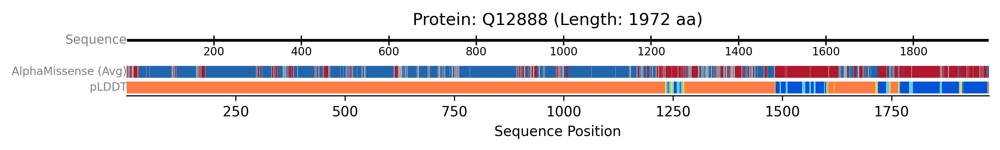

# Visualising AlphaFold Data (pLDDT and AlphaMissense)

<button class="btn js-toggle-dark-mode">Dark mode</button>

<script>
const toggleDarkMode = document.querySelector('.js-toggle-dark-mode');

jtd.addEvent(toggleDarkMode, 'click', function(){
  if (jtd.getTheme() === 'dark') {
    jtd.setTheme('light');
    toggleDarkMode.textContent = 'Dark mode';
  } else {
    jtd.setTheme('dark');
    toggleDarkMode.textContent = 'Light mode';
  }
});
</script>
---

Here, we demonstrate how to fetch and display both pLDDT confidence scores and AlphaMissense pathogenicity predictions from the AlphaFold Database.
{: .fs-6 .fw-300 }

This script targets a human protein (Q9BYF1) for which AlphaMissense data is typically available. It uses AFDBClient to fetch both pLDDT scores and AlphaMissense predictions.

* An `AxisTrack` provides the sequence scale.
* A single `AlphaFoldTrack` is configured to display both plddt and alphamissense data. These are rendered as two separate, labelled sub-tracks within the AlphaFoldTrack group, allowing for direct comparison of model confidence and predicted variant impact along the sequence.

```python
from protviz import plot_protein_tracks
from protviz.data_retrieval import AFDBClient, get_protein_sequence_length
from protviz.tracks import AlphaFoldTrack, AxisTrack

def main():
    uniprot_id = "Q12888" # A human protein known to have AlphaMissense data
    afdb_client = AFDBClient()

    try:
        seq_length = get_protein_sequence_length(uniprot_id)
        print(f"Sequence length for {uniprot_id}: {seq_length}")

        # Fetch both pLDDT and AlphaMissense data
        alphafold_data = afdb_client.get_alphafold_data(
            uniprot_id,
            requested_data_types=["plddt", "alphamissense"]
        )
        print("Fetched AlphaFold data.")
        if alphafold_data.get("plddt"):
            print(f"  pLDDT scores available: {len(alphafold_data['plddt'])}")
        if alphafold_data.get("alphamissense"):
            print(f"  AlphaMissense scores available: {len(alphafold_data['alphamissense'])}")


        # Create tracks
        axis_trk = AxisTrack(sequence_length=seq_length, label="Sequence")

        # Create a single AlphaFoldTrack to display both data types
        alphafold_multidata_track = AlphaFoldTrack(
            afdb_data=alphafold_data,
            plotting_options=["plddt", "alphamissense"], # Specify both to be plotted
            main_label="", # Overall label for this group of AF tracks
            plddt_label="pLDDT",
            alphamissense_label="AlphaMissense (Avg)",
            sub_track_height=0.1, # Height for each row (pLDDT, AlphaMissense)
            sub_track_spacing=0.05 # Space between the pLDDT and AlphaMissense rows
        )

        # Plot the tracks
        plot_protein_tracks(
            protein_id=uniprot_id,
            sequence_length=seq_length,
            tracks=[axis_trk, alphafold_multidata_track],
            figure_width=10,
            save_option=True
        )
        print(f"AlphaFold example plot saved as {uniprot_id}_plot.png")

    except Exception as e:
        print(f"An error occurred during the AlphaFold example: {e}")
        import traceback
        traceback.print_exc()

if __name__ == "__main__":
    main()
```

The previous example will generate a plot like this one:


