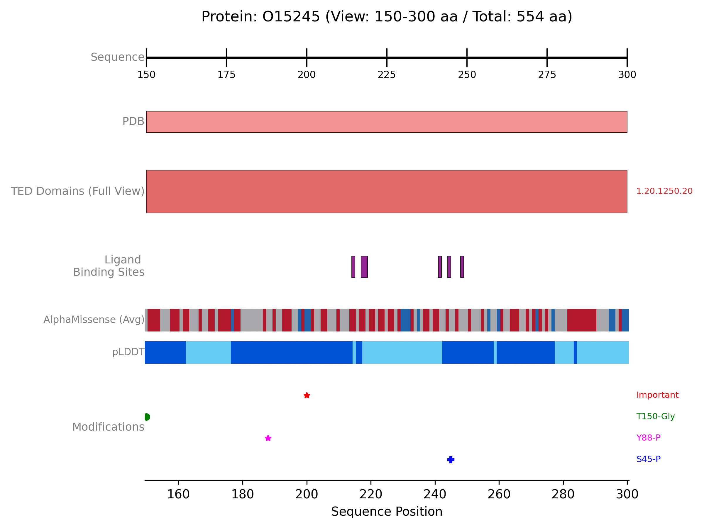

## Zooming into Specific Regions & Comprehensive Visualisation


<button class="btn js-toggle-dark-mode">Dark mode</button>

<script>
const toggleDarkMode = document.querySelector('.js-toggle-dark-mode');

jtd.addEvent(toggleDarkMode, 'click', function(){
  if (jtd.getTheme() === 'dark') {
    jtd.setTheme('light');
    toggleDarkMode.textContent = 'Dark mode';
  } else {
    jtd.setTheme('dark');
    toggleDarkMode.textContent = 'Light mode';
  }
});
</script>
---

This example focuses on zooming.
{: .fs-6 .fw-300 }

Protviz allows you to focus on specific areas of a protein sequence for a more detailed inspection of annotations. This is achieved by providing `view_start_aa` and `view_end_aa` arguments to the `plot_protein_tracks` function.

The following example demonstrates how to create a comprehensive plot for the protein "O15245", fetching data from PDBe, AlphaFold Database, and the TED database.
It then generates a zoomed-in view of a specific region (residues 150-300, adjusted if the protein is shorter), displaying PDB coverage, TED domains, ligand interactions, AlphaFold metrics (pLDDT and AlphaMissense), and custom PTM annotations.

### Example: Multi-Track Plot with Zoom


```python
from protviz import plot_protein_tracks
from protviz.data_retrieval import AFDBClient, PDBeClient, get_protein_sequence_length, TEDClient
from protviz.tracks import (
    AlphaFoldTrack,
    AxisTrack,
    CustomTrack,
    LigandInteractionTrack,
    PDBTrack,
    TEDDomainsTrack,
)

def main():
    uniprot_id = "O15245" # Target protein UniProt ID

    # 1. Initialise Data Retrieval Clients
    pdbe_client = PDBeClient()
    afdb_client = AFDBClient()
    ted_client = TEDClient()

    try:
        print(f"--- Protein: {uniprot_id} ---")
        # 2. Fetch Overall Protein Information
        seq_length = get_protein_sequence_length(uniprot_id)
        print(f"Sequence length for {uniprot_id}: {seq_length}")

        # 3. Fetch Data from Various Sources
        print(f"\nFetching PDB ligand interactions for {uniprot_id}...")
        ligand_data = pdbe_client.get_pdb_ligand_interactions(uniprot_id)
        if ligand_data:
            print(f"Found {len(ligand_data)} ligand interaction contexts.")
        else:
            print(f"No ligand interaction data found for {uniprot_id}.")

        print(f"\nFetching PDB coverage for {uniprot_id}...")
        pdb_coverage_data = pdbe_client.get_pdb_coverage(uniprot_id)
        if pdb_coverage_data:
            print(f"Found {len(pdb_coverage_data)} PDB entries.")
        else:
            print("No PDB coverage data found.")

        print(f"\nFetching AlphaFold data for {uniprot_id} (pLDDT and AlphaMissense)...")
        alphafold_data = afdb_client.get_alphafold_data(
            uniprot_id, requested_data_types=["plddt", "alphamissense"]
        )
        # (Optional: print statements for AlphaFold data counts)

        print(f"\nFetching TED domain annotations for {uniprot_id}...")
        ted_domain_annotations = ted_client.get_TED_annotations(uniprot_id)
        if ted_domain_annotations:
            print(f"Found {len(ted_domain_annotations)} TED domain annotations.")
        else:
            print(f"No TED annotation data found for {uniprot_id}.")

        # 4. Define Zoom Region
        # Initial desired zoom start and end amino acid positions
        zoom_s, zoom_e = 150, 300
        # Adjust zoom window if the protein is shorter than the desired end
        if seq_length < zoom_e:
            zoom_s = seq_length // 4  # Start at one quarter of the sequence length
            zoom_e = (seq_length // 4) * 3 # End at three quarters
        # Ensure start is less than end, and handle very short sequences
        if zoom_s >= zoom_e:
            zoom_s = 1
            zoom_e = seq_length
        print(f"\nPlotting Zoomed View for region: {zoom_s}-{zoom_e}")

        # 5. Create Tracks for the Visualisation
        # Axis track, always showing the context of the total sequence length
        axis_trk_zoom = AxisTrack(
            sequence_length=seq_length, # Total length for correct scaling context
            label="Sequence",
        )

        # PDB coverage track, collapsed for a summary view within the zoom
        pdb_trk_detail_zoom = PDBTrack(
            pdb_data=pdb_coverage_data,
            label="PDB",
            plotting_option="collapse",
            color="lightcoral",
        )

        # TED domains track, shown in "full" detail
        ted_domains_trk_detailed = TEDDomainsTrack(
            ted_annotations=ted_domain_annotations,
            label="TED Domains", # Adjusted label for clarity
            plotting_option="full",
            show_domain_labels=True,
        )

        # Ligand interaction track, collapsed for the zoomed view
        ligand_trk = LigandInteractionTrack(
            interaction_data=ligand_data,
            label="Ligand Binding", # Shortened label for space
            show_ligand_labels=True, # Still useful if space permits in "full"
            plotting_option="collapse", # Changed to collapse for zoomed summary
            site_height=0.1,
        )

        # AlphaFold track showing both pLDDT and AlphaMissense
        alphafold_track = AlphaFoldTrack(
            afdb_data=alphafold_data,
            plotting_options=["plddt", "alphamissense"],
            main_label="", # Minimal label if space is tight or redundant
            plddt_label="pLDDT",
            alphamissense_label="AlphaMissense", # Simplified label
            sub_track_height=0.1,
            sub_track_spacing=0.05
        )

        # Custom track for Post-Translational Modifications (PTMs)
        ptm_annotations = [
            {"position": 245, "label": "S245-P", "color": "blue", "display_type": "marker", "marker_symbol": "P"},
            {"position": 188, "label": "Y188-P", "color": "#FF00FF", "display_type": "marker", "marker_symbol": "*"},
            {"position": 150, "label": "T150-Gly", "color": "green", "display_type": "marker", "marker_symbol": "s", "marker_size": 5}, # Example of a different marker
            {"position": 200, "label": "Important", "color": "red", "display_type": "marker", "marker_symbol": "X", "marker_size": 7},
        ]
        ptms_track = CustomTrack(
            annotation_data=ptm_annotations,
            label="Modifications",
            ann_height=0.05,
            show_row_labels=False, # Assuming PTMs don't need row labels here
            padding=0.05,
        )

        # 6. Plot the Tracks with Zoom Parameters
        print("\nPlotting...")
        plot_protein_tracks(
            protein_id=f"{uniprot_id}_zoomed", # Indicate zoom in filename
            sequence_length=seq_length,
            tracks=[ # Order of tracks matters for display
                axis_trk_zoom,
                pdb_trk_detail_zoom,
                ted_domains_trk_detailed,
                ligand_trk,
                alphafold_track,
                ptms_track,
            ],
            view_start_aa=zoom_s,       # Start of the zoomed region
            view_end_aa=zoom_e,         # End of the zoomed region
            figure_width=10,             # Adjusted figure width for zoom
            # figure_height=6,          # Explicitly set figure height if desired
            save_option=True
        )
        print(f"Zoomed plot saved as {uniprot_id}_zoomed_plot.png")

    except Exception as e:
        print(f"An error occurred: {e}")
        import traceback
        traceback.print_exc()

if __name__ == "__main__":
    main()
```


The previous example will generate a plot like this one:


