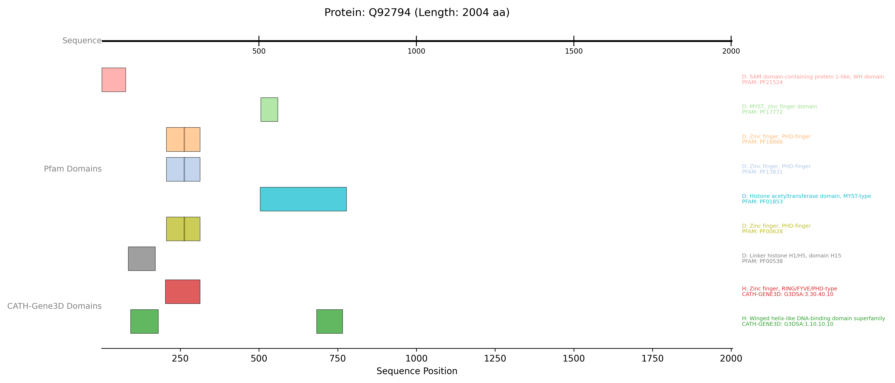

# Visualising InterPro Domain Annotations (Pfam and CATH-Gene3D)

<button class="btn js-toggle-dark-mode">Dark mode</button>

<script>
const toggleDarkMode = document.querySelector('.js-toggle-dark-mode');

jtd.addEvent(toggleDarkMode, 'click', function(){
  if (jtd.getTheme() === 'dark') {
    jtd.setTheme('light');
    toggleDarkMode.textContent = 'Dark mode';
  } else {
    jtd.setTheme('dark');
    toggleDarkMode.textContent = 'Light mode';
  }
});
</script>
---

This example demonstrates fetching domain information from InterPro member databases, specifically Pfam and CATH-Gene3D, and visualising them.
{: .fs-6 .fw-300 }

This script uses the `InterProClient` to fetch domain annotations from both Pfam and CATH-Gene3D for the protein **p53 (P04637)**.

* An `AxisTrack` sets the sequence scale.
* Two `InterProTrack` instances are created: one for Pfam data and one for CATH-Gene3D data.
* Both tracks use plotting_option="full" and show_domain_labels=True to display each domain signature in its own lane, labelled with its accession, name, and InterPro entry type. The database_name_for_label parameter is crucial for accurate labelling in "full" mode. This allows for a clear comparison of domain architectures as defined by different InterPro member databases.


```python
from protviz import plot_protein_tracks
from protviz.data_retrieval import InterProClient, get_protein_sequence_length
from protviz.tracks import AxisTrack, InterProTrack

def main():
    uniprot_id = "Q92794" # p53 - has Pfam and CATH-Gene3D entries via InterPro
    interpro_client = InterProClient()

    try:
        seq_length = get_protein_sequence_length(uniprot_id)
        print(f"Sequence length for {uniprot_id}: {seq_length}")

        # Fetch Pfam annotations
        pfam_annotations = interpro_client.get_pfam_annotations(uniprot_id)
        if pfam_annotations:
            print(f"Found {len(pfam_annotations)} Pfam annotations.")
        else:
            print("No Pfam annotations found.")

        # Fetch CATH-Gene3D annotations
        cath_gene3d_annotations = interpro_client.get_cathgene3d_annotations(uniprot_id)
        if cath_gene3d_annotations:
            print(f"Found {len(cath_gene3d_annotations)} CATH-Gene3D annotations.")
        else:
            print("No CATH-Gene3D annotations found.")

        # Create tracks
        axis_trk = AxisTrack(sequence_length=seq_length, label="Sequence")

        pfam_trk = InterProTrack(
            domain_data=pfam_annotations,
            database_name_for_label="Pfam", # Important for labelling
            label="Pfam Domains",
            plotting_option="full",
            show_domain_labels=True
        )

        cath_gene3d_trk = InterProTrack(
            domain_data=cath_gene3d_annotations,
            database_name_for_label="CATH-Gene3D", # Important for labelling
            label="CATH-Gene3D Domains",
            plotting_option="full",
            show_domain_labels=True
        )

        # Plot the tracks
        plot_protein_tracks(
            protein_id=uniprot_id,
            sequence_length=seq_length,
            tracks=[axis_trk, pfam_trk, cath_gene3d_trk],
            figure_width=14,
            figure_height = 6,
            save_option=True
        )
        print(f"InterPro example plot saved as {uniprot_id}_plot.png")

    except Exception as e:
        print(f"An error occurred during the InterPro example: {e}")
        import traceback
        traceback.print_exc()

if __name__ == "__main__":
    main()
```


The previous example will generate a plot like this one:


