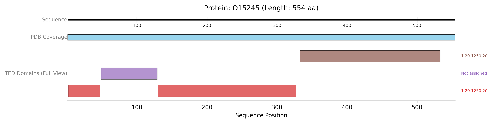

# Visualising TED  Annotations

<button class="btn js-toggle-dark-mode">Dark mode</button>

<script>
const toggleDarkMode = document.querySelector('.js-toggle-dark-mode');

jtd.addEvent(toggleDarkMode, 'click', function(){
  if (jtd.getTheme() === 'dark') {
    jtd.setTheme('light');
    toggleDarkMode.textContent = 'Dark mode';
  } else {
    jtd.setTheme('dark');
    toggleDarkMode.textContent = 'Light mode';
  }
});
</script>
---

This example focuses on fetching domain annotations from the TED database and displaying them.
{: .fs-6 .fw-300 }

The script uses TEDClient to retrieve domain annotations for the given UniProt ID.

* An `AxisTrack` is included.
* A `PDBTrack` is added to show the PDB coverage, providing structural context to the TED domains.
* The `TEDDomainsTrack` is configured with plotting_option="full" to display each distinct TED annotation (which may itself comprise multiple segments) in a separate, uniquely coloured lane. show_domain_labels=True ensures that CATH labels associated with these domains are displayed.

```python
from protviz import plot_protein_tracks
from protviz.data_retrieval import TEDClient, get_protein_sequence_length, PDBeClient
from protviz.tracks import AxisTrack, TEDDomainsTrack, PDBTrack # Added PDBTrack for context

def main():
    uniprot_id = "O15245" # Example UniProt ID with TED annotations
    ted_client = TEDClient()
    pdbe_client = PDBeClient() # For adding PDB context

    try:
        seq_length = get_protein_sequence_length(uniprot_id)
        print(f"Sequence length for {uniprot_id}: {seq_length}")

        # Fetch TED annotations
        ted_domain_annotations = ted_client.get_TED_annotations(uniprot_id)
        if ted_domain_annotations:
            print(f"Found {len(ted_domain_annotations)} TED domain annotations.")
        else:
            print(f"No TED annotation data found for {uniprot_id}.")

        # Fetch PDB coverage for context
        pdb_coverage = pdbe_client.get_pdb_coverage(uniprot_id)

        # Create tracks
        axis_trk = AxisTrack(sequence_length=seq_length, label="Sequence")

        pdb_context_trk = PDBTrack(
            pdb_data=pdb_coverage,
            label="PDB Coverage",
            plotting_option="collapse"
        )

        ted_domains_trk_detailed = TEDDomainsTrack(
            ted_annotations=ted_domain_annotations,
            label="TED Domains (Full View)",
            plotting_option="full", # Show each TED annotation in its own lane
            show_domain_labels=True # Display CATH labels if available
        )

        # Plot the tracks
        plot_protein_tracks(
            protein_id=uniprot_id,
            sequence_length=seq_length,
            tracks=[axis_trk, pdb_context_trk, ted_domains_trk_detailed],
            figure_width=12,
            save_option=True
        )
        print(f"TED example plot saved as {uniprot_id}_plot.png")

    except Exception as e:
        print(f"An error occurred during the TED example: {e}")
        import traceback
        traceback.print_exc()

if __name__ == "__main__":
    main()
```


The previous example will generate a plot like this one:


